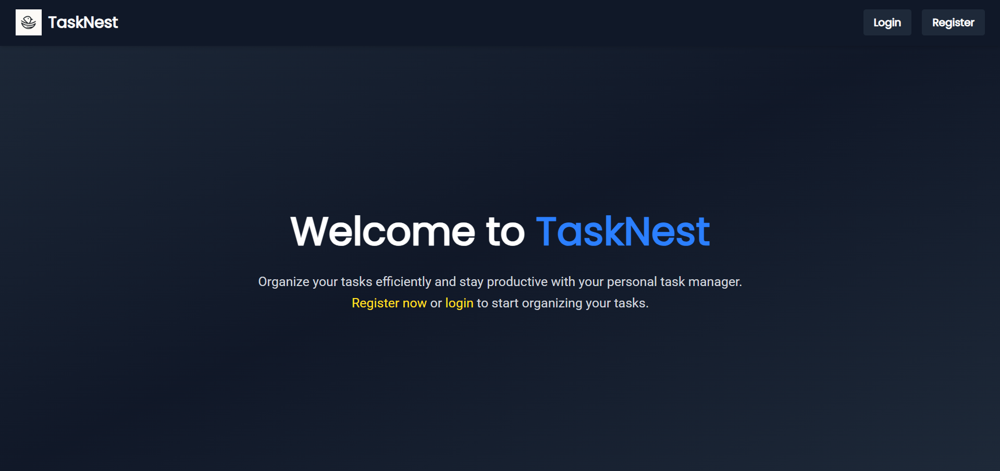
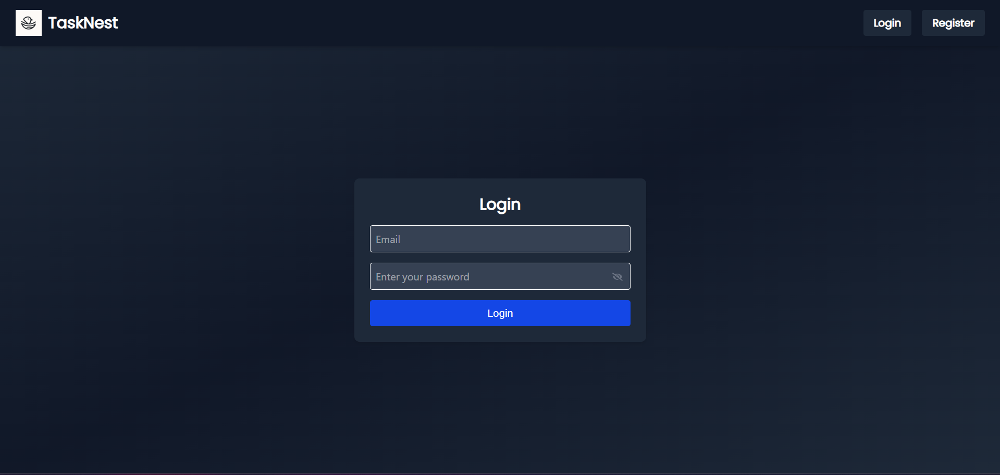
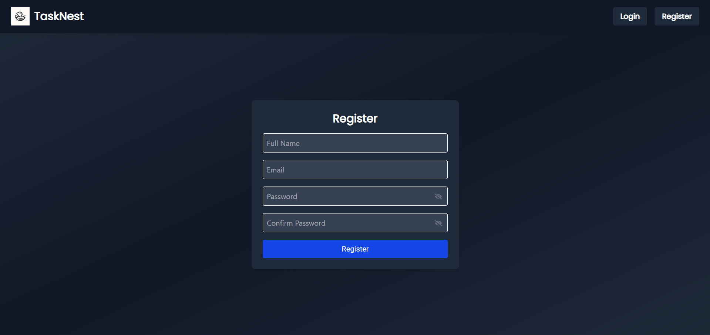
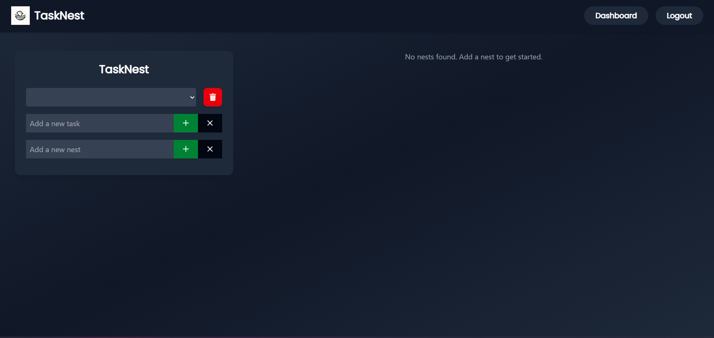
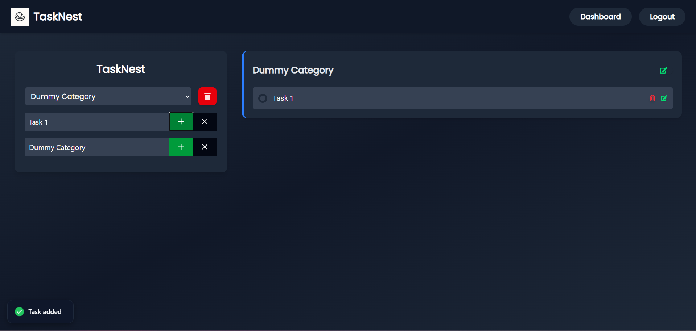

# TaskNest 🪺 – Organize your Tasks, Effortlessly

**TaskNest** is a full-stack task management app built with the **MERN** (MongoDB, Express, React, Node.js) stack. It supports creating categorized task groups (called "nests") and lets users manage their tasks with a clean, dark-themed dashboard UI.

---

## 📸 Project Showcase

| Home Page | Login Page | Registration Page | Dashboard | Sammple |
|-----------|------------|-------------------|-----------|---------|
|  |  |  |  |  |

---

## 🚀 Features

- User authentication (Registration/Login)
- Dark-themed task dashboard
- Create, update, delete task categories ("Nests")
- Add, edit, delete tasks inside nests
- Mark tasks as complete
- Visual feedback via toast notifications
- Secure routes with frontend auth check
- Mobile responsive layout

---

## 🛠️ Tech Stack

### Frontend
- React + Vite
- React Hook Form + Yup (Validation)
- React Router
- TailwindCSS (UI)
- Axios
- React Hot Toast

### Backend
- Node.js + Express
- MongoDB + Mongoose
- bcrypt (Password hashing)
- JSON Web Token (JWT - stored in localStorage)
- Nodemailer (Email verification)
- dotenv

---

## 📂 Folder Structure

```
tasknest/
├── client/            # React frontend
│   ├── src/
│   │   ├── pages/
│   │   ├── components/
│   │   ├── store/     # AuthContext
│   │   ├── utils/
│   │   └── ...
│   └── ...
├── server/            # Node.js backend
│   ├── models/
│   ├── routes/
│   ├── middleware/
│   └── ...
└── ...
```

---

## ⚙️ Environment Variables

Create a `.env` file in the **server** root directory with the following keys:

```env
PORT=5000
MONGO_URI=your_mongodb_connection_string
JWT_SECRET=your_jwt_secret_key
CLIENT_URL=http://localhost:5173
EMAIL_HOST=smtp.ethereal.email
EMAIL_USER=your_email_user
EMAIL_PASS=your_email_password
```
You can use [Ethereal](https://ethereal.email/) for email testing.

Create a `.env` file in the `client/` directory:

```env
VITE_API_BASE_URL=http://localhost:5000
```


---

## 🧪 How to Run Locally

### 1. Clone the Repo

```bash
git clone https://github.com/your-username/tasknest.git
cd tasknest
```

### 2. Start the Backend

```bash
cd server
npm install
npm run dev
```

Backend will start on `http://localhost:5000`

### 3. Start the Frontend

```bash
cd ../client
npm install
npm run dev
```

Frontend will start on `http://localhost:5173`

---

## 📦 API Endpoints

| Method | Endpoint            | Description             |
|--------|---------------------|-------------------------|
| POST   | /api/auth/register  | Register new user       |
| POST   | /api/auth/login     | Login user              |
| POST   | /api/auth/dashboard | Protected Dashboard     |
| GET    | /api/nests          | Get all nests           |
| POST   | /api/nests          | Create new nest         |
| PATCH  | /api/nests/:id      | Update nest             |
| DELETE | /api/nests/:id      | Delete nest             |
| GET    | /api//nests/:nestId/tasks      | Get nest tasks|
| POST    | /api//nests/:nestId/tasks      | Create task in nest |
| PATCH  | /api/nests/:nestId/:taskId      | Update task in nest |
| DELETE | /api/nests/:nestId/:taskId      | Delete task         |

---

## 💡 Notes

- JWT is stored in localStorage (not HttpOnly cookie) for simplicity in this beginner project.
- For more secure production apps, consider switching to HttpOnly cookie-based authentication.

---

## 📧 Contact

Built with ❤️ by Muhammad Umar  
_If you like the project, give it a star ⭐ and share it!_